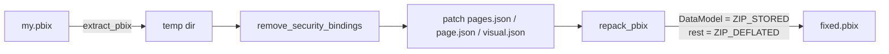

# Power BI Master Skill


[](LICENSE)
[](https://www.python.org/)
[](#requirements)
[-F2C811.svg)](#what-it-works-on)
[](#requirements)
[](#use-it-as-an-ai-agent-skill)

> **A deterministic, scriptable automation engine and engineering standard for professional Power BI development.**
> It performs direct **PBIX surgery** (JSON + ZIP), injects a **universal DAX library tuned for the Indian Numbering System (Lakh / Crore)** straight into the live model over SSAS/TOM, and enforces a consistent **CEO‑style visual standard** — all from one ~2,000‑line CLI. Drive it by hand, from CI, or from an AI agent (Gemini CLI, OpenCode, Agy).

---

## Table of contents

- [Why this exists](#why-this-exists)
- [How it compares](#how-it-compares)
- [What it works on](#what-it-works-on)
- [How PBIX surgery works](#how-pbix-surgery-works)
- [Requirements](#requirements)
- [Install](#install)
- [Quick start](#quick-start)
- [Command reference](#command-reference)
- [The DAX library (Indian Lakh/Crore)](#the-dax-library-indian-lakhcrore)
- [Live‑model measure injection (SSAS / TOM)](#livemodel-measure-injection-ssas--tom)
- [Visual build standards](#visual-build-standards)
- [Use it as an AI agent skill](#use-it-as-an-ai-agent-skill)
- [Critical safety rules](#critical-safety-rules)
- [Repository layout](#repository-layout)
- [Limitations & assumptions](#limitations--assumptions)
- [FAQ](#faq)
- [License](#license)

---

## Why this exists

Power BI Desktop is a point‑and‑click tool. That's fine for one report, but it falls apart the moment you need to do the *same* thing **consistently, repeatedly, and at scale**:

- Disable the auto‑subtitle on **every** visual across **every** page.
- Re‑style **all** KPI cards to a single corporate standard.
- Sort every category chart descending and rename measures to canonical names.
- Inject a vetted DAX library (revenue, growth, Indian‑format display measures) into a model.
- Swap a freshly‑built data model into a report someone already laid out.
- Audit a model for the classic `Measure = Measure = VAR ...` duplicated‑name corruption and fix it.

Doing that by hand is slow, inconsistent, and impossible to review. **Power BI Master Skill** turns each of those into a single, reproducible command that operates directly on the `.pbix` file structure and the live model — no clicking, no drift, fully version‑controllable.

It ships in two halves:

| Part | File | What it is |
|------|------|------------|
| **The engine** | `powerbi_automation.py` | A unified CLI (~2,000 lines, consolidated from 52 ad‑hoc scripts) that does the actual surgery. |
| **The standard** | `SKILL.md` | A machine‑readable rulebook an AI agent reads to build/repair reports to the same standard by hand. |

---

## How it compares

|                                   | **Power BI Master Skill** | Manual editing in Power BI Desktop | "Ask an LLM to fix my report" | Generic PBI REST/XMLA scripts |
|-----------------------------------|:--:|:--:|:--:|:--:|
| Reproducible / version‑controllable | ✅ deterministic | ❌ manual every time | ❌ non‑deterministic | ⚠️ partial |
| Bulk across all pages/visuals      | ✅ one command | ❌ click each one | ❌ can't touch the binary | ⚠️ model only, not visuals |
| Edits the **PBIX binary** directly | ✅ ZIP + JSON surgery | n/a | ❌ | ❌ |
| Live‑model DAX injection (TOM)     | ✅ built‑in | ⚠️ manual | ❌ | ✅ |
| Indian **Lakh / Crore** formatting | ✅ first‑class | ⚠️ hand‑rolled | ⚠️ inconsistent | ❌ |
| DAX corruption audit & auto‑fix    | ✅ | ❌ | ❌ | ❌ |
| Offline / no service, no cost      | ✅ 100% local | ✅ | ❌ cloud | ⚠️ needs gateway/service |
| Core runtime dependencies          | **none** (stdlib) | — | — | several |

An LLM can *suggest* DAX, but it can't reach inside the ZIP and rewrite `visual.json`. A REST/XMLA script can touch the model, but not the report layout. This tool does **both**, deterministically, on your machine.

---

## What it works on

- **`.pbix` files saved in the modern Enhanced Report format (PBIR)** — i.e. the report definition lives under `Report/definition/pages/**` as `pages.json`, `page.json`, and per‑visual `visuals/*.json`. (Enable in Power BI Desktop: *Options → Preview features → "Store reports using enhanced metadata format / PBIR"*.)
- **Windows** for the live‑model and save features (they talk to Power BI Desktop's embedded SSAS instance and send keystrokes). The pure file‑surgery commands are OS‑independent Python.

---

## How PBIX surgery works

A `.pbix` is just a ZIP archive. This tool unzips it, edits the JSON inside, and **repacks it correctly** — which has one non‑obvious, mandatory rule:

```
my_report.pbix  (ZIP)
├── DataModel              ← MUST be repacked with ZIP_STORED (no compression)
├── Report/
│   └── definition/
│       └── pages/
│           ├── pages.json         ← page order + active page
│           └── <pageId>/
│               ├── page.json      ← page name, size, display options
│               └── visuals/
│                   └── <visId>/visual.json   ← every visual, fully described
├── SecurityBindings       ← REMOVED on every repack for portability
└── ... (everything else → ZIP_DEFLATED)
```



If you compress `DataModel`, the report **won't open**. If you leave `SecurityBindings` in, it may refuse to open on another machine. The engine handles both for you on every write — see [Critical safety rules](#critical-safety-rules).

---

## Requirements

The **core is zero‑dependency** — every file‑surgery command (`analyze`, `fix-visuals`, `rebuild-pbix`, `overhaul`, `build-v16/17`, page ops, `swap-datamodel`, `backup`, …) runs on the **Python standard library** alone.

| Feature | Needs | Why |
|---------|-------|-----|
| All PBIX file surgery | **Python 3.9+** (stdlib only) | `zipfile`, `json`, `xml.etree`, `argparse` |
| `measures *` (live DAX inject / audit / list) | **`pythonnet`** + **Analysis Services client libraries** (AMO/TOM — ship with Power BI Desktop & SSMS) | connects to the embedded SSAS model via `Microsoft.AnalysisServices.Tabular` |
| `save` (Ctrl+S to persist live changes) | **`pywin32`** | sends keystrokes to the Power BI Desktop window |

> The two optional packages are **only** needed for the live‑model features and are **Windows‑only**. If you never run `measures` or `save`, you need nothing beyond Python.

---

## Install

```bash
# 1. Get the skill
git clone https://github.com/Jignesh-Gond/Power-BI-Master-Skill.git
cd Power-BI-Master-Skill

# 2. (Optional) install the extras only if you want live-model / save features
pip install -r requirements.txt

# 3. Verify
python powerbi_automation.py --help
```

The core CLI works immediately with a plain Python install — no `pip install` required.

---

## Quick start

```bash
# Inspect a report (pages, visuals, fields)
python powerbi_automation.py analyze my_report.pbix

# Always back up before surgery
python powerbi_automation.py backup my_report.pbix

# Clean every visual: kill auto-subtitles, apply KPI styling & display units
python powerbi_automation.py fix-visuals my_report.pbix -o cleaned.pbix --fix-aggs

# Full executive overhaul (subtitles + KPI + ranking + repack)
python powerbi_automation.py overhaul my_report.pbix -v 15 -o final.pbix

# Inject the universal Indian-format DAX library into the OPEN report's live model
python powerbi_automation.py measures inject-v16
python powerbi_automation.py save           # persist with Ctrl+S
```

**Recommended workflow:** `backup` → file surgery (`fix-visuals` / `overhaul` / `build-v16`) → open in Desktop → `measures inject-v16` → `measures audit` → `save`.

---

## Command reference

Global: `-o/--output PATH` sets the output file (most surgery commands write a new `.pbix` and leave the original untouched).

### Inspection & integrity
| Command | What it does |
|---------|--------------|
| `analyze <pbix>` | Full structure dump — pages, visuals, fields. |
| `analyze-visuals <pbix>` | Visual types, titles, and bound fields. |
| `verify <pbix>` | Sanity‑check PBIX integrity. |
| `list-pages <pbix>` | List page display names in order. |

### Page operations
| Command | What it does |
|---------|--------------|
| `reorder-pages <pbix> "A,B,C"` | Reorder pages by display name. |
| `remove-pages <pbix> "A,B"` | Delete pages by display name. |
| `add-page <pbix> "Name"` | Append a blank page. |
| `add-ranking-page <pbix>` | Add Customer / Sales‑Rep ranking pages. |

### Visual surgery
| Command | What it does |
|---------|--------------|
| `fix-visuals <pbix> [--display-units 0D] [--fix-aggs]` | Force‑disable subtitles, apply KPI styling, set display units, optionally remap aggregations → measures. |
| `align-visuals <pbix>` | Snap visuals to a clean grid layout. |
| `rebuild-pbix <pbix>` | Rebuild the report with the standard 4‑page layout. |
| `overhaul <pbix> -v <7‑15>` | Versioned overhaul: subtitle + KPI + ranking + repack. |
| `build-v16 <pbix>` | v15→v16: auto‑subtitles, descending sort, canonical names, CEO dashboard. |
| `build-v17 <pbix>` | v16→v17: Executive Summary page, off‑canvas slicers, navigation. |

### Data model
| Command | What it does |
|---------|--------------|
| `swap-datamodel <source> <target>` | Drop the `DataModel` from *source* into *target* (correct `ZIP_STORED` repack). |
| `measures list` | List measures in the live model. |
| `measures add [--measures-list "A,B"]` | Add measures from the built‑in library (all, or a subset). |
| `measures fix-formats` | Apply correct format strings (`%`, Indian, etc.) to measures. |
| `measures audit` | Scan for DAX corruption (duplicated names) and auto‑fix. |
| `measures export [-o file.dax]` | Export the model's measures to a `.dax` reference. |
| `measures inject-v16` | Inject the full universal DAX library + fix `Date` references. |

### Utility
| Command | What it does |
|---------|--------------|
| `backup <pbix>` | Write a timestamped `.BACKUP` copy. |
| `save [--window-title "..."]` | Send Ctrl+S to Power BI Desktop to persist live‑model changes. |

Run `python powerbi_automation.py <command> --help` for per‑command options.

---

## The DAX library (Indian Lakh/Crore)

Western tooling formats large numbers as **1.2M / 3.4B**. Indian business reporting uses **Lakh (1,00,000)** and **Crore (1,00,00,000)** with a different digit‑grouping. The library encodes that correctly and dynamically.

**1 — Dynamic Indian grouping** (places commas as `##,##,###` for any magnitude):
```dax
Indian Format Display =
VAR Val = [Target Measure]
VAR SafeLog = IF(Val > 0, FLOOR(LOG10(Val + 0.0000001), 1), 0)
VAR GroupsAfter3 = MIN(3, MAX(0, ROUNDUP((SafeLog - 2) / 2, 0)))
VAR Pattern = IF(GroupsAfter3 = 0, "#,##0", REPT("#,##\,", GroupsAfter3) & "##0")
RETURN IF(Val = 0 || ISBLANK(Val), "0", FORMAT(Val, Pattern))
```

**2 — Cr / Lakh suffix:**
```dax
Display Amount =
VAR v = [Raw Amount]
RETURN SWITCH(TRUE(),
    v >= 10000000, FORMAT(v/10000000, "0.00") & " Cr",
    v >= 100000,   FORMAT(v/100000,  "0.00") & " L",
    FORMAT(v, "#,0"))
```

**3 — Growth intelligence:**
```dax
Dynamic Growth % =
VAR Prev = CALCULATE([Total Revenue], DATEADD('Date'[Date], -1, MONTH))
RETURN DIVIDE([Total Revenue] - Prev, Prev)
```

`measures inject-v16` installs ~20 measures built on these patterns, including: `Total Revenue`, `Total Revenue (CR)`, `Total Revenue Indian`, `Total QTY` / `Total QTY Indian`, `Total Products`, `*  (Display)` variants, `Dynamic Growth %`, `QoQ Growth %`, `YoY Growth %`, and `Growth Category / Arrow / Color` for conditional KPI styling.

> ℹ️ The built‑in measures assume a sample sales schema (`'SalesTable'[Final Rate]`, `[QTY]`, `[Product]`, and a `'Date'` table). Edit `BASE_MEASURES_DICT` near the top of `powerbi_automation.py` to point them at your own model — see [Limitations](#limitations--assumptions).

---

## Live‑model measure injection (SSAS / TOM)

When Power BI Desktop opens a report, it spins up a private **SSAS Tabular** instance. The `measures` commands attach to it and edit the model **live** via TOM (Tabular Object Model):

1. **Discover the port** — scans `netstat`/`tasklist` for the `PowerBIDesktop.exe`‑owned `MSAS` port (`find_port` / `find_port_retry`).
2. **Connect** — `Microsoft.AnalysisServices.Tabular.Server.Connect("Data Source=localhost:<port>")` via `pythonnet`.
3. **Mutate** — add/fix measures, set format strings, repair duplicated‑name corruption.
4. **Persist** — `model.SaveChanges()` updates the *live* model only; run `save` (Ctrl+S) to write it back into the `.pbix`.

> Power BI Desktop must be **open** with the target report for any `measures` command to work.

---

## Visual build standards

`SKILL.md` defines a full "CEO‑style" layout standard so every report looks the same. Highlights (see `SKILL.md` for the complete spec):

- **720px canvas grid** — KPI cards row (y≈5, h80), slicers (y≈95, h50), main charts (y≈160, h260), trend row (y≈435, h250).
- **KPI cards** — `#E6F3FF` title band, `#17614A` deep‑green value, `0D` padding.
- **The subtitle fix (critical)** — `subTitle.show = false` must be set in **three** places, with a **capital "T"**: `vco.subTitle`, `objs.subTitle`, and `objs.general.autoSubtitle`.
- **Coloring** — explicit hex (`#333333`) over `ThemeDataColor` for reliable contrast.
- **Charts** use the `labels` key, **not** `dataLabels`.

---

## Use it as an AI agent skill

This repo is structured as a portable **agent skill**. `SKILL.md` carries YAML frontmatter (`name`, `description`) and a complete rulebook, so an agent can read it and perform expert‑level Power BI work to the standard.

Drop the folder into your agent's skills directory:

```text
# Gemini CLI / OpenCode / Agy CLI
<your-project>/.opencode/skills/power-bi-master/      ← this repo
                 └── SKILL.md   (auto-discovered)
```

The agent then knows the safety rules, the visual standard, the DAX patterns, and which `powerbi_automation.py` command to call for a given request — e.g. *"clean up the subtitles and convert revenue to Crores"* → `fix-visuals` + `measures inject-v16` + `save`.

---

## Critical safety rules

These are enforced by the engine and codified in `SKILL.md` / `MEMORY.md`. If you script against the PBIX yourself, honour them:

1. **Never modify a PBIX while it's open** in Power BI Desktop — you'll corrupt the ZIP. (Live `measures` changes are the deliberate exception, done through SSAS, not the file.)
2. **`DataModel` repacks with `ZIP_STORED`** (no compression). Everything else uses `ZIP_DEFLATED`.
3. **Strip `SecurityBindings`** on every repack so the file opens on any machine — do this **before** pushing a `.pbix` anywhere.
4. **Run `measures audit`** after model edits to catch the `Measure = Measure = VAR…` duplicated‑name corruption.
5. **`SaveChanges()` ≠ saved file** — always `save` (Ctrl+S) to persist live‑model edits to disk.

---

## Repository layout

```text
Power-BI-Master-Skill/
├── powerbi_automation.py   # The unified automation CLI (~2,000 lines)
├── SKILL.md                # Agent rulebook: standards, rules, DAX, command map
├── MEMORY.md               # Hard-won technical notes & gotchas
├── README.md               # You are here
├── LICENSE                 # MIT
├── requirements.txt        # Optional extras (pythonnet, pywin32)
├── .gitignore
└── assets/
    └── preview.png         # Banner
```

> `.pbix`, `.BACKUP`, and temporary extract folders are **git‑ignored** — they contain your business data and should never be committed. See `.gitignore`.

---

## Limitations & assumptions

- **PBIR only** — reports must be saved in the enhanced metadata (PBIR) format; the legacy single‑blob `Layout` format is not targeted.
- **Built‑in measures are schema‑specific** — `BASE_MEASURES_DICT` references a sample `'SalesTable'` / `'Date'` model. Adapt it to your columns before `measures inject-v16`.
- **Live‑model & `save` are Windows‑only** and require Power BI Desktop running with the report open, plus `pythonnet` + AMO/TOM client libraries.
- **`save` uses keystroke automation** (Ctrl+S to the foreground window); keep the Desktop window available while it runs.
- **Some `build-v*` / `overhaul` layouts encode a specific dashboard design** (KPI + ranking + executive summary). Treat them as opinionated templates and tune the coordinates in the source for your brand.

---

## FAQ

**Does this need the Power BI Service, a gateway, or any cloud account?**
No. Everything runs locally against `.pbix` files and the local Desktop model.

**Will it work on my Mac/Linux?**
The file‑surgery commands (the majority) are pure Python and run anywhere. The `measures` and `save` commands need Windows + Power BI Desktop.

**Is my data safe to commit?**
Keep `.pbix`/`.BACKUP` out of git — they're ignored by default. Always strip `SecurityBindings` (the engine does this on repack) before sharing a file.

**Can an LLM just do this?**
An LLM can draft DAX and describe layouts, but it can't deterministically rewrite the binary `.pbix` or guarantee the `ZIP_STORED` / subtitle / audit rules. This tool does, every time.

---

## License

[MIT](LICENSE) © 2026 **JG (Jignesh Gond)**.

Optional runtime extras are distributed under their own licenses: **pythonnet** (MIT), **pywin32** (PSF), and Microsoft **Analysis Services client libraries / AMO‑TOM** (Microsoft license — ships with Power BI Desktop / SSMS).

---

*Built by JG for the global Power BI community. If this standard saves you time, please ⭐ the repo.*
